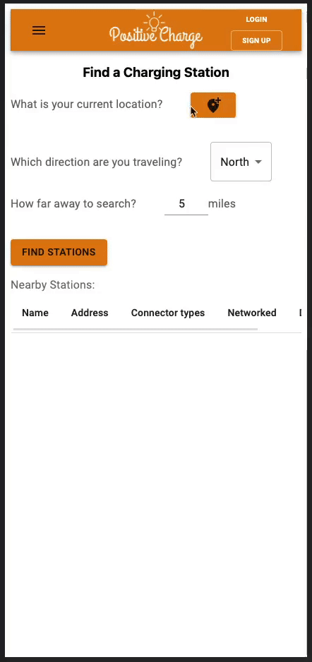
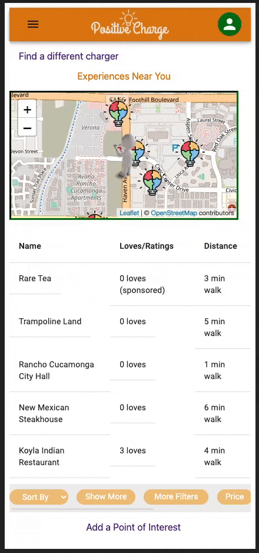
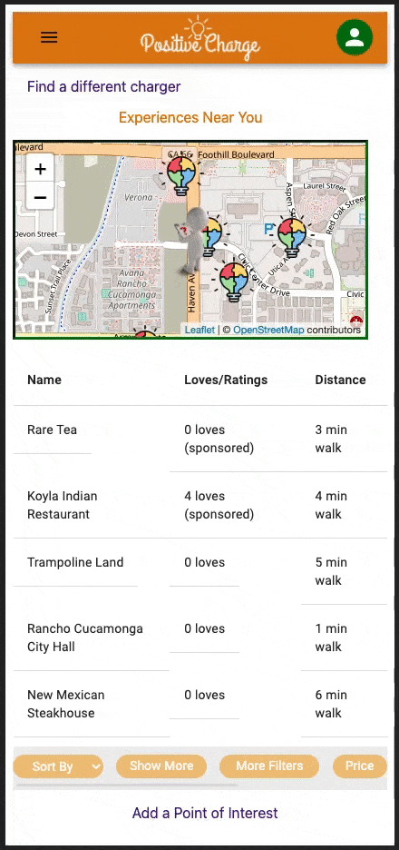
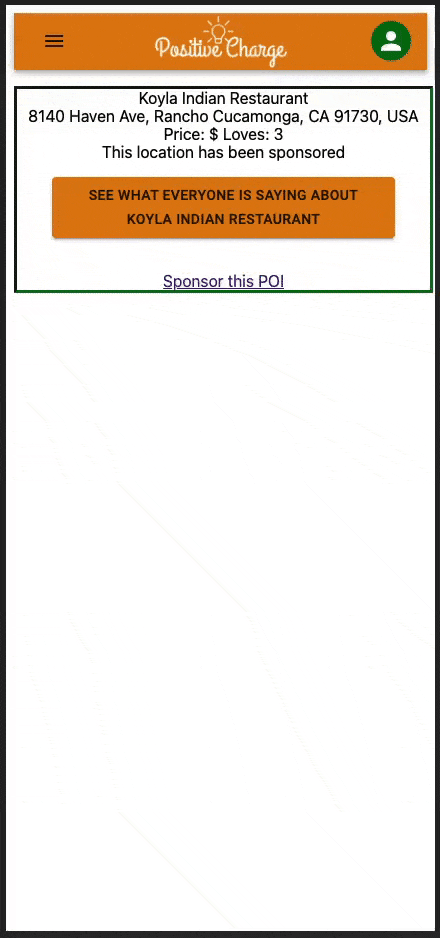
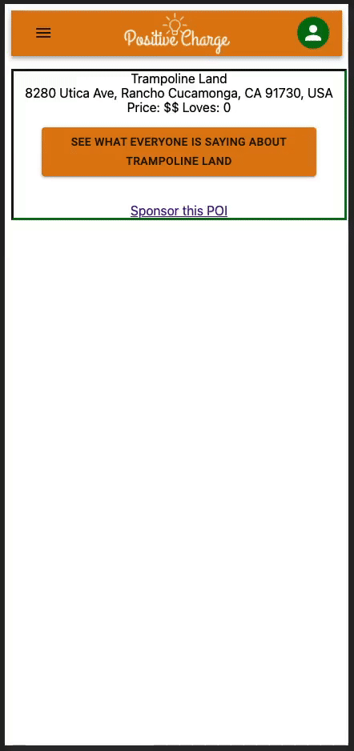

# PositiveCharge

Technologies used...

| Engineer | Title | Linked In | Github |
|:--------:|:------:|:----------:|:-----:|
|Dakota Lust|Architecture Owner, Software Engineer|<a href="https://www.linkedin.com/in/dakota-lust-06618a20a/"><a/>|<a href="https://github.com/ColonelKrust"><a/>|
|Dominic Carullo|UI Owner, Software Engineer|<a href="https://www.linkedin.com/in/dominic-carullo/"><a/>|<a href="https://github.com/DominicCarullo"><a/>|
|Dwight Doran|Software Engineer| <a href="https://www.linkedin.com/in/dwightdoran"><a/>|<a href="https://github.com/dwightdoran"><a/>|
|Jeff Fox|Product Manager, Software Engineer|<a href="https://www.linkedin.com/in/jeffox/"><a/>|    <a href="https://github.com/jefffock"><a/>|
|Joseph Lee|Software Engineer|<a href="https://www.linkedin.com/in/josephelee1/"><a/>|    <a href="https://github.com/joseflee"><a/>|
|Justin Tat|Software Engineer|<a href="https://www.linkedin.com/in/justin-tat-30a994238/"><a/>|    <a href="https://github.com/justin-tat"><a/>|
|Mendel Hung|Software Engineer|<a href="https://www.linkedin.com/in/mendel-hung-4a888b34/"><a/>|    <a href="https://github.com/mendelorian"><a/>|

# Features
- Find Charging Station: Dakota Lust
- Mapping: Justin Tat
- See Points of Interest - Dominic Carullo
- Authentication and Sponsors - Mendel Hung
- Add Points of Interest - Jeff Fox
- Filter Points of Interest - Joseph Lee
- Comment and Like Points of Interest - Dwight Doran

# Authentication
- Authentication by Mendel Hung

# Finding a Point of Interest
- Find PoI by Dominic Carullo
- Mapping by Justin Tat
- Filtering by Joseph Lee

# Adding a Point of Interest
- Add PoI by Jeff Fox

# Liking and Commenting on a Point of Interest
- Like and Comment on PoI by Dwight Doran

# Sponsoring a Point of Interest
- Sponsor a PoI by Mendel Hung

